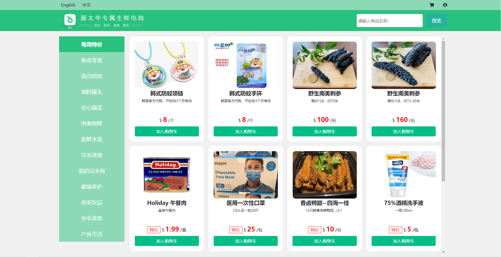
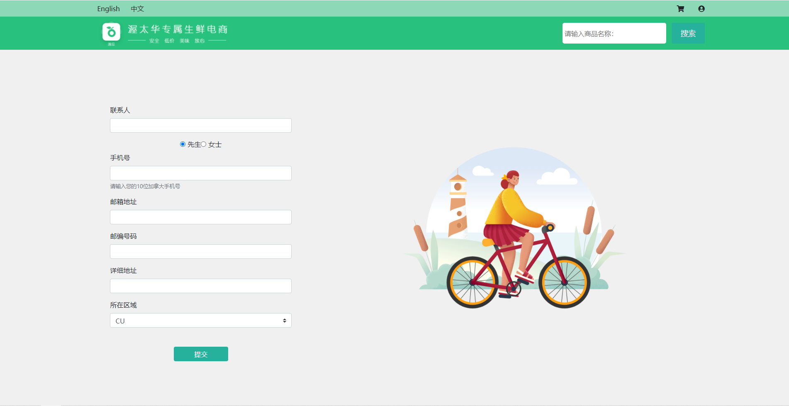
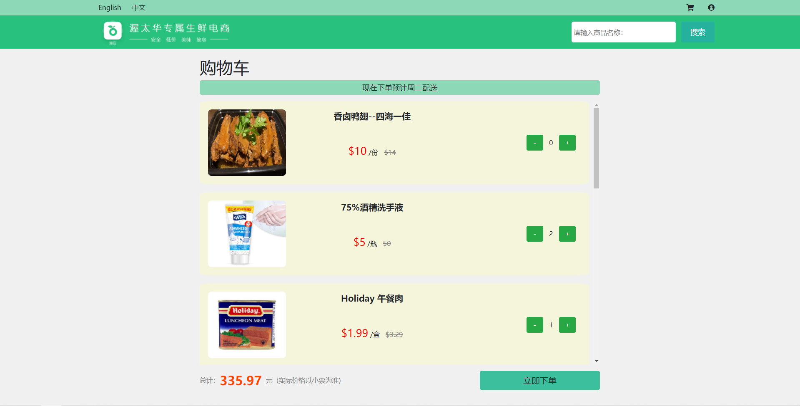

## Introduction

This SPA website is what I developed when I served as volunteer in OCMA(Ottawa Chinese Musician's Association).
 The reason why I established this project is to provide a web platform for people to order online. Due to COVID-19,
  people feel stressed and unsafe to go outdoors, especially for those crowded indoor places. The team OCMA spontaneously
 launched a project to deliver food and daily necessities to the residents of Ottawa, mainly for those international students
 and elders. Clients can easily log in our website and order merchandises freely. In this process, they need to provide
 the basic delivery information, such as nickname, contact number and address. Delivery fee will be automatically calculated 
 when the target delivery place is filled. 

## Project Analysis

The grocery delivery project technically consists of three parts: front-end website, back-end server and database.
For the back-end development and database setup, a great team done these and wrote Restful API documents for the front-end, 
which is helpful. By checking the API document, I can easily transfer these get and post requests. The front-end part is built
 with ReactJS library, which is a pretty popular way to deal with client service. The building of front-end would follow the 
 UI/UX design rules. The user should feel comfortable and enjoyment when using services. 

### Home Page

Homepage consists of three parts: Top line, Banner and Merchandise. Every page in this website consists of both Top line and Banner,
 making it easy for clients to transfer to shopping cart, profile and search result. As you can see, the left column lists different 
 species of good, such as raw food, groceries and necessaries. You can see items in different class on right part of the page. Each item on
  the right part is shown as a merchandise card. Here you can see the exterior, name, description, price, and sale condition of the item.
  There's also a button where you can add the item to your cart. 
  
### Profile

Profile page is the place where people submit their delivery information. In order to keep privacy of customers, the merchant only ask for 
basic address and contact information about users. These content and choices are stored in the localstorage of the explorer so people don't
 have to refill the form when they use the delivery service next time.
 
### Shopping Cart

This page shows what's in your shopping cart, total price, estimated arrive date. You can check out with one click. Also, customers are 
able to edit the quantity of any item in the cart. The data of cart is stored in the dataset and every time people open this page, a request
is sent to the back-end, and the server would return the cart of the specific user. Once people click the checkout button, the request would
be sent to the server and the only thing people need to do is preparing for the call.

### Tech skills application

Technically, this project is almost fully developed using ReactJS. Besides that, Redux-React is applied to achieve usage between states of 
different branches. All user's personal information, merchandises and shopping cart content are stored in the local storage of the explorer. 
It makes it easier and faster to load up the website every time refresh. All classes of items are stored in the local storage so every time 
people click any class on the left list, the right list of items would show up instantly. Bootstrap 4 is applied here to make the interface 
fancy. I also used Adobe XD to draw illustrate pictures to beautify pages.

This project was bootstrapped with [Create React App](https://github.com/facebook/create-react-app).

## Available Scripts

In the project directory, you can run:

### `npm start`

Runs the app in the development mode. 
Open [http://localhost:3000](http://localhost:3000) to view it in the browser.

The page will reload if you make edits. 
You will also see any lint errors in the console.

### `npm test`

Launches the test runner in the interactive watch mode. 
See the section about [running tests](https://facebook.github.io/create-react-app/docs/running-tests) for more information.

### `npm run build`

Builds the app for production to the `build` folder. 
It correctly bundles React in production mode and optimizes the build for the best performance.

The build is minified and the filenames include the hashes. 
Your app is ready to be deployed!

See the section about [deployment](https://facebook.github.io/create-react-app/docs/deployment) for more information.

### `npm run eject`

**Note: this is a one-way operation. Once you `eject`, you can’t go back!**

If you aren’t satisfied with the build tool and configuration choices, you can `eject` at any time. This command will remove the single build dependency from your project.

Instead, it will copy all the configuration files and the transitive dependencies (webpack, Babel, ESLint, etc) right into your project so you have full control over them. All of the commands except `eject` will still work, but they will point to the copied scripts so you can tweak them. At this point you’re on your own.

You don’t have to ever use `eject`. The curated feature set is suitable for small and middle deployments, and you shouldn’t feel obligated to use this feature. However we understand that this tool wouldn’t be useful if you couldn’t customize it when you are ready for it.

## Learn More

You can learn more in the [Create React App documentation](https://facebook.github.io/create-react-app/docs/getting-started).

To learn React, check out the [React documentation](https://reactjs.org/).

### Code Splitting

This section has moved here: https://facebook.github.io/create-react-app/docs/code-splitting

### Analyzing the Bundle Size

This section has moved here: https://facebook.github.io/create-react-app/docs/analyzing-the-bundle-size

### Making a Progressive Web App

This section has moved here: https://facebook.github.io/create-react-app/docs/making-a-progressive-web-app

### Advanced Configuration

This section has moved here: https://facebook.github.io/create-react-app/docs/advanced-configuration

### Deployment

This section has moved here: https://facebook.github.io/create-react-app/docs/deployment

### `npm run build` fails to minify

This section has moved here: https://facebook.github.io/create-react-app/docs/troubleshooting#npm-run-build-fails-to-minify

